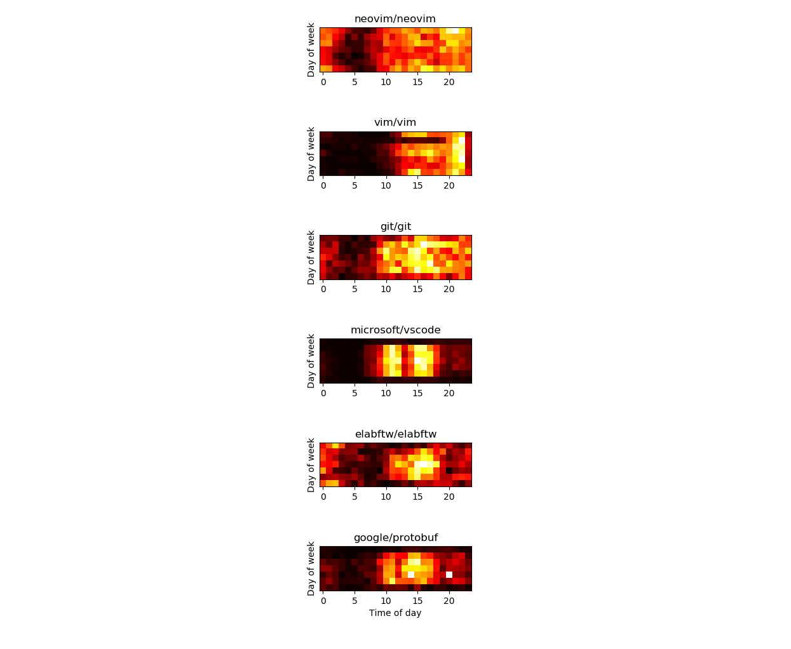

# punchkard

## Description

Plot punch card from a list of github repos.

## Usage

Generate a new Github token to access the API and put in in env as GITHUB_TOKEN.

Requires numpy, requests and matplotlib. If you use [pipenv](https://pipenv.readthedocs.io/en/latest/) you can do `pipenv sync` to install the dependencies.

~~~bash
    export GITHUB_TOKEN=d294c9ffaf4ab6a43c0d80436207873c8e688f6e
    ./punchkard.py # or pipenv run punchkard.py
~~~

## Example output

